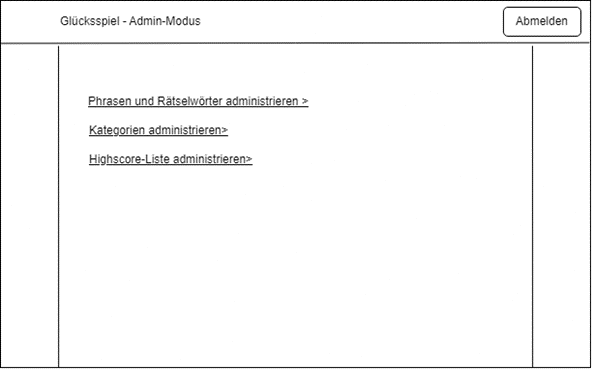
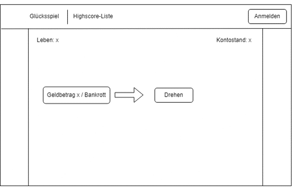
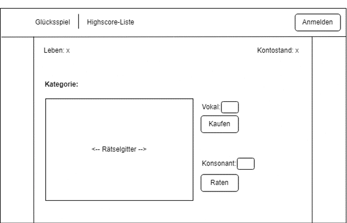

# Projekt-Dokumentation

Peterhans

| Datum | Version | Zusammenfassung                                              |
| ----- | ------- | ------------------------------------------------------------ |
| 23.02.2023 | 0.0.1   | Eine React App mit Tailwind.css, Navigationsleiste, Login, Registrierung und Firebase wurde erstellt. |
| 27.02.2023 | 0.0.2   | Registrierung wurde entfernt und der Adminmodus für das Login implementiert. |
| 28.02.2023 | 0.0.3   | Der Startpage wurde einschliesslich des Adminmodus implementiert. |
| 01.03.2023 | 0.0.4   | Der Spinner und der Spielmechanismus mit den Phrasen wurde implementiert. |
| 02.03.2023 | 1.0.0   | Highscoreliste mit Adminmodus wurde hinzugefügt. |

# 0 Ihr Projekt

In diesem Projekt geht es um ein webbasiertes Glücksrad-Spiel, bei der man Phrasen erraten und Guthaben gewinnen kann.

# 1 Analyse

* Tier 1 (Presentation): Administrator-Ansicht, Spielansicht für den Kandidaten
* Tier 2 (Webserver): Formular für das Anmelden, Glücksrad drehen, Eingaben der Vokalen und Konsonanten
* Tier 3 (Application Server): Verarbeitung der eingegebenen Werte wie für das Anmelden oder das Spielen selbst
* Tier 4 (Dataserver): Verwaltung der Daten für das Spiel mittels einer Datenbank

# 2 Technologie

* Tier 1 (Presentation): HTML, CSS, JavaScript
* Tier 2 (Webserver): React App
* Tier 3 (Application Server): node.js
* Tier 4 (Dataserver): Firebase

# 3 Datenbank

Als Datenbank wird "Firebase" benutzt. Mit einer Initialisierung in einer JavaScript-Datei kann man auf sie zugreifen. Das Interface der Datenbank ist mit Sammlungen und in denen mit Dokumentationen aufgebaut.

# 4.1 User Stories

✍️ Formulieren Sie weitere, eigene Anforderungen und Testfälle, wie Sie Ihre Applikation erweitern möchten. Geben Sie diesen statt einer Nummer einen Buchstaben (`A`, `B`, etc.)

| US-№ | Verbindlichkeit | Typ  | Beschreibung                       |
| ---- | --------------- | ---- | ---------------------------------- |
| 1    | Muss | Funktional | Als Administrator möchte ich mich anmelden können, damit ich das Spiel administrieren kann. |
| 2    | Muss | Funktional | Als Administrator möchte ich Phrasen und Rätselwörter administrieren können, damit diese während dem Spiel angewandt werden können. |
| 3    | Muss | Funktional | Als Administrator möchte ich Kategorien anlegen können, damit ich weitere neue Wörter oder Fragen zu diesen zuordnen kann |
| 4    | Muss | Funktional | Als Administrator möchte ich Einträge der Highscore-Liste löschen können, damit manipulierte Spiele nicht in dieser Liste angezeigt werden.|
| 5    | Muss | Funktional | Als Kandidat möchte ich auf die Website zugreifen können, damit ich am Spiel teilnehmen kann. |
| 6    | Muss | Funktional | Als Kandidat möchte ich meinen Namen eingeben können, damit ich auf der Highscore-Liste angezeigt werde. |
| 7    | Muss | Qualität | Als Kandidat möchte ich meinen Kontostand ansehen können, damit ich weiss, wie riskant ich das Spiel spielen soll. |
| 8    | Muss | Qualität | Als Kandidat möchte ich meine Lebenspunkte ansehen können, damit ich nicht vergesse, wie viele Lebenspunkte ich während dem Spiel habe. |
| 9    | Muss | Qualität | Als Kandidat möchte ich, dass mir mitgeteilt wird, ob meine Antwort richtig oder falsch war, damit ich weiss, welche Buchstaben ich als Nächstes angeben muss. |
| 10   | Muss | Qualität | Als Kandidat möchte ich eine Highscore-Liste mit Rang, Name des Spielers, Zeitpunkt des Spiels, Geldbetrag und Anzahl Runden ansehen können, damit ich alle Informationen von allen Spielern einsehen kann. |
| 11   | Muss | Qualität | Als Kandidat möchte ich eine Highscore-Liste sortiert nach Rang und Geldbetrag ansehen können, damit ich schnell den Spieler mit dem niedrigsten Guthaben ansehen kann. |
| 12   | Muss | Qualität | Als Kandidat möchte ich, dass die Phrasen und Rätselwörter mir nur einmal gestellt werden, damit ich eine Herausforderung habe, die Lösung herauszufinden. |
| 13   | Muss | Funktional | Als Kandidat möchte ich jederzeit spielen, oder aufhören und meinen Gewinn in die Highscore-Liste übernehmen können, | 14   | Muss | Qualität | Als Kandidat möchte ich eine spielbare Anzahl von Phrasen und Wörter, damit bei möglichen Problemen der Gewinn wirklich abgespeichert wird. |
| 14   | Muss | Qualität | Als Kandidat möchte ich ein Spiel mit einer spielbaren Anzahl von Phrasen und Wörter spielen können, damit ich nicht zu lange an einem Spiel dran bin. |
| 15   | Muss | Qualität | Als Kandidat möchte ich, dass die Anzahl Spielrunden gezählt wird, damit ich am Ende den durchschnittlichen Gewinn pro Runde berechnen kann. |
| A   | Muss | Funktion | Als Kandidat möchte ich das Glücksrad nochmal drehen kann, damit ich eine höhere Chance habe, einen Geldbetrag zu erspielen. |
| B   | Muss | Qualität | Als Kandidat möchte ich einen gratis Vokal drehen können, damit ich beim nächsten Zug keinen Vokal erkaufen muss. |

# 4.2 Testfälle

| TC-№ | Vorbereitung | Eingabe | Erwartete Ausgabe |
| ---- | ------------ | ------- | ----------------- |
| 1.1  | <ul><li>Die Webapplikation ist auf einem Webbrowser geöffnet</li><li>- Benutzername: admin - Passwort: admin123*</li></ul> | <ol><li>Benutzername eingeben (admin)</li><li>Passwort eingeben (admin123)</li><li>Auf "Anmelden" klicken</li></ol> | Dem Administrator wird die Website in Administrator-Modus angezeigt. |
| 2.1  | <ul><li>Die Webapplikation ist auf einem Webbrowser geöffnet</li><li>Administrator-Modus ist an (Benutzername = "admin", Passwort = "admin123")</li></ul> | <ol><li>Klicke auf "Phrasen und Rätselwörter administrieren"</li><li>Klicke auf "hinzufügen"</li><li>Wähle als Typ "Rätselwort" aus</li><li>Gebe "HalloTest" ein</li><li>Klicke auf "Bestätigen"</li></ol> | In der Liste mit den Phrasen und Rätselwörtern ist nach dem Erstellen dazu eine neue Zeile dazugekommen. |
| 2.2  | <ul><li>Die Webapplikation ist auf einem Webbrowser geöffnet</li><li>Administrator-Modus ist an (Benutzername = "admin", Passwort = "admin123")</li></ul> | <ol><li>Klicke auf "Phrasen und Rätselwörter administrieren"</li><li>Klicke in der Liste beim Rätselwort "Testing" auf "bearbeiten"</li><li>Gebe "HalloTest" ein</li><li>Klicke auf "Bestätigen"</li></ol> | In der Liste mit den Phrasen und Rätselwörtern ist das ausgewählte Rätselwort bearbeitet worden. |
| 2.3  | <ul><li>Die Webapplikation ist auf einem Webbrowser geöffnet</li><li>Administrator-Modus ist an (Benutzername = "admin", Passwort = "admin123")</li></ul> | <ol><li>Klicke auf "Phrasen und Rätselwörter administrieren"</li><li>Klicke in der Liste beim Rätselwort "Testing2" auf "löschen"</li><li>Klicke auf "Bestätigen"</li></ol> | In der Liste mit den Phrasen und Rätselwörtern wurde das ausgewählte Rätselwort gelöscht. |
| 3.1  | <ul><li>Die Webapplikation ist auf einem Webbrowser geöffnet</li><li>Administrator-Modus ist an (Benutzername = "admin", Passwort = "admin123")</li></ul> | <ol><li>Klicke auf "Kategorien administrieren"</li><li>Klicke auf "erstellen"</li><li>Gebe "HalloTest" ein</li><li>Klicke auf "Bestätigen"</li></ol> | In der Liste wurde die Kategorie hinzugefügt. |
| 3.2  | <ul><li>Die Webapplikation ist auf einem Webbrowser geöffnet</li><li>Administrator-Modus ist an (Benutzername = "admin", Passwort = "admin123")</li></ul> | <ol><li>Klicke auf "Kategorien administrieren"</li><li>Klicke in der Liste bei der Kategorie "KatTesting" auf "hinzufügen"</li><li>Wähle "KatWort" aus</li><li>Klicke auf "Bestätigen"</li></ol> | Unter der Kategorie wird das ausgewählte Wort hinzugefügt und unter dieser Kategorie angezeigt. |
| 4.1  | <ul><li>Die Webapplikation ist auf einem Webbrowser geöffnet</li><li>Administrator-Modus ist an (Benutzername = "admin", Passwort = "admin123")</li></ul> | <ol><li>Klicke auf "Highscore-Liste administrieren"</li><li>Klicke in der Liste beim Kandidat "DerManipulierer" auf "entfernen"</li><li>Klicke auf "Bestätigen"</li></ol> | Von der Highscore-Liste wurde der ausgewählte Kandidat entfernt. |
| 5.1  | <ul><li>Das Git-Repository <a href='https://github.com/benjyros/PeterhansBenjamin_LB151' target="_blank">PeterhansBenjamin_LB151</a> ist geöffnet</li></ul> | <ol><li>Klicke rechts auf den Link für die Website</li></ol> | Dem Benutzer wird die Website zum Spiel angezeigt. |
| 6.1  | <ul><li>Die Webapplikation ist auf einem Webbrowser geöffnet</li></ul> | <ol><li>Klicke auf "Jetzt Spielen"</li><li>Gebe als Namen "EinKandidat" ein</li><li>Klicke auf "Bestätigen"</li><li>Klicke in der Navigation auf "Highscore-Liste"</li></ol> | In der Highscore-Liste wird der neu erstelle Spieler angezeigt. |
| 7.1  | <ul><li>Die Webapplikation ist auf einem Webbrowser geöffnet</li></ul> | <ol><li>Klicke auf "Jetzt Spielen"</li><li>Gebe als Namen "EinKandidat2" ein</li><li>Klicke auf "Bestätigen"</li></ol> | Oben rechts des Spielansichts wird der Kontostand des Spielers angezeigt.  |
| 8.1  | <ul><li>Die Webapplikation ist auf einem Webbrowser geöffnet</li></ul> | <ol><li>Klicke auf "Jetzt Spielen"</li><li>Gebe als Namen "EinKandidat3" ein</li><li>Klicke auf "Bestätigen"</li></ol> | Oben links des Spielansichts werden die Lebenspunkte des Spielers angezeigt. |
| 9.1  | <ul><li>Die Webapplikation ist auf einem Webbrowser geöffnet</li></ul> | <ol><li>Klicke auf "Jetzt Spielen"</li><li>Gebe als Namen "EinKandidat4" ein</li><li>Klicke auf "Bestätigen"</li><li>Klicke auf "Drehen"</li><li>Gebe unter "Konsonanten" den Buchstabem 'm' ein</li><li>Klicke auf "Raten"</li></ol> | Es wird angezeigt, ob der eingegebene Konsonant richtig war oder nicht. |

✍️ Die Nummer hat das Format `N.m`, wobei `N` die Nummer der User Story ist, die der Testfall abdeckt, und `m` von `1` an nach oben gezählt. Beispiel: Der dritte Testfall, der die zweite User Story abdeckt, hat also die Nummer `2.3`.

# 5 Prototyp
### Mockup des Admin-Interface: 

### Mockup der Spielansicht 1 des Kandidaten: 

### Mockup der Spielansicht 2 des Kandidaten: 

# 6 Implementation

✍️ Halten Sie fest, wann Sie welche User Story bearbeitet haben

| User Story | Datum      | Beschreibung |
| ---------- | ---------- | ------------ |
| 5          | 23.02.2023 | Durch die Erstellung der Website wird als Anzeige ein Webbrowser benutzt |
| 1          | 23.02.2023 | Login erstellt, jedoch nicht funktionsfähig |
| 1          | 27.02.2023 | Login fertiggestellt |
| 6          | 28.02.2023 | Formular zur Startseite hinzugefügt |
| 1          | 28.02.2023 | Adminmodus ausgefeinert |
| 7          | 01.03.2023 | Beim Starten wird der Kontostand angezeigt (funktioniert nicht) |
| 8          | 01.03.2023 | Beim Starten werden die Lebenspunkte angezeigt (funktioniert nicht) |
| 12         | 01.03.2023 | Vorkommen der Phrasen wurde auf 1 limitiert |
| 14         | 01.03.2023 | Implementation für das Erraten von Phrasen |
| A          | 01.03.2023 | Extra Dreh für das Glücksrad ist vorhanden |
| 4          | 02.03.2023 | Nebst der Highscoreliste gibt es einen Lösch-Button für Admins|
| 7          | 02.03.2023 | Anzeige des Kontostands ausgebessert |
| 8          | 02.03.2023 | Anzeige der Lebenspunkte ausgebessert |
| 9          | 02.03.2023 | Alert nach dem Raten eines Vokals oder Konsonanten |
| 10         | 02.03.2023 | Highscoreliste mit den Daten implementiert |
| 11         | 02.03.2023 | Aufsteigende Highscoreliste nach Guthaben hinzugefügt |
| 13         | 02.03.2023 | Einen Button hinzugefügt, damit man das Spiel manuell beenden kann |
| 15         | 02.03.2023 | Anzahl Spielrunden wird mit gezählt (1 Dreh = 1 Runde) |
| B          | 02.03.2023 | Bei einem Dreh "Gratis Vokal" kann man einen Vokal gratis erkaufen |

# 7 Projektdokumentation

| US-№  | Erledigt?   | Entsprechende Code-Dateien oder Erklärung |
| ----- | ----------- | ----------------------------------------- |
| 1     | ja          | [wheel-of-fortune/src/Login.js](wheel-of-fortune/src/Login.js#L34-L54) |
| 2     | nein        |                                           |
| 3     | nein        |                                           |
| 4     | ja          | [wheel-of-fortune/src/Highscorelist.js](wheel-of-fortune/src/Highscorelist.js#L91-L95) |
| 5     | ja          | Beim Starten des Programms wird der Startbildschirm auf dem Webbrowser angezeigt. |
| 6     | ja          | [wheel-of-fortune/src/Start.js](wheel-of-fortune/src/Start.js#L82) |
| 7     | ja          | [wheel-of-fortune/src/Play.js](wheel-of-fortune/src/Play.js#L277) |
| 8     | ja          | [wheel-of-fortune/src/Play.js](wheel-of-fortune/src/Play.js#L274) |
| 9     | ja          | [wheel-of-fortune/src/Play.js](wheel-of-fortune/src/Play.js#L196-L200) |
| 10    | ja          | [wheel-of-fortune/src/Highscorelist.js](wheel-of-fortune/src/Highscorelist.js#L70-L100) |
| 11    | ja          | [wheel-of-fortune/src/Highscorelist.js](wheel-of-fortune/src/Highscorelist.js#L15-L30) |
| 12    | ja          | [wheel-of-fortune/src/Play.js](wheel-of-fortune/src/Play.js#L41-L44) (Nach jedem Erraten einer Phrase wird der Index dafür erhöht, weshalb man somit die vorherigen nicht mehr spielen kann.) |
| 13    | ja          | [wheel-of-fortune/src/Play.js](wheel-of-fortune/src/Play.js#L343) |
| 14    | ja          | Die Daten der Phrasen sind in der Datenbank gespeichert. |
| 15    | ja          | [wheel-of-fortune/src/Play.js](wheel-of-fortune/src/Play.js#L217) |
| A     | ja          | [wheel-of-fortune/src/Play.js](wheel-of-fortune/src/Play.js#L71-L73) |
| B     | ja          | [wheel-of-fortune/src/Play.js](wheel-of-fortune/src/Play.js#L74-L81) |

# 8 Testprotokoll

✍️ Fügen Sie hier den Link zu dem Video ein, welches den Testdurchlauf dokumentiert.

| TC-№  | Datum      | Resultat | Tester             | Video            |
| ----- | ---------- | -------- | ------------------ | ---------------- |
| 1.1   | 02.03.2023 | OK       | Peterhans Benjamin |[![US1]](Datas/1.mp4)|
| 2.1   | 02.03.2023 | NOK      | Peterhans Benjamin |                  |
| 3.1   | 02.03.2023 | NOK      | Peterhans Benjamin |                  |
| 4.1   | 02.03.2023 | OK       | Peterhans Benjamin |[![US4]](Datas/4.mp4)|
| 5.1   | 02.03.2023 | OK       | Peterhans Benjamin |[![US4]](Datas/5.mp4)|
| 6.1   | 02.03.2023 | OK       | Peterhans Benjamin |[![US6]](Datas/6.mp4)|
| 7.1   | 02.03.2023 | OK       | Peterhans Benjamin |[![US7]](Datas/7.mp4)|
| 8.1   | 02.03.2023 | OK       | Peterhans Benjamin |[![US8]](Datas/8.mp4)|
| 9.1   | 02.03.2023 | OK       | Peterhans Benjamin |[![US9]](Datas/9.mp4)|
| 10.1  | 02.03.2023 | OK       | Peterhans Benjamin |[![US10]](Datas/10.mp4)|
| 11.1  | 02.03.2023 | OK       | Peterhans Benjamin |[![US11]](Datas/11.mp4)|
| 12.1  | 02.03.2023 | OK       | Peterhans Benjamin |[![US12]](Datas/12.mp4)|
| 13.1  | 02.03.2023 | OK       | Peterhans Benjamin |[![US13]](Datas/13.mp4)|
| 14.1  | 02.03.2023 | OK       | Peterhans Benjamin |[![US14]](Datas/14.mp4)|
| 15.1  | 02.03.2023 | OK       | Peterhans Benjamin |[![US15]](Datas/14.mp4)|
| A.1   | 02.03.2023 | OK       | Peterhans Benjamin |[![USA]](Datas/12.mp4)|
| B.1   | 02.03.2023 | OK       | Peterhans Benjamin |[![USB]](Datas/12.mp4)|

✍️ Vergessen Sie nicht, ein Fazit hinzuzufügen, welches das Test-Ergebnis einordnet.

# 9 `README.md`

✍️ Beschreiben Sie ausführlich in einer README.md, wie Ihre Applikation gestartet und ausgeführt wird. Legen Sie eine geeignete Möglichkeit (Skript, Export, …) bei, Ihre Datenbank wiederherzustellen.

# 10 Allgemeines

- [ ] Ich habe die Rechtschreibung überprüft
- [ ] Ich habe überprüft, dass die Nummerierung von Testfällen und User Stories übereinstimmen
- [ ] Ich habe alle mit ✍️ markierten Teile ersetzt
